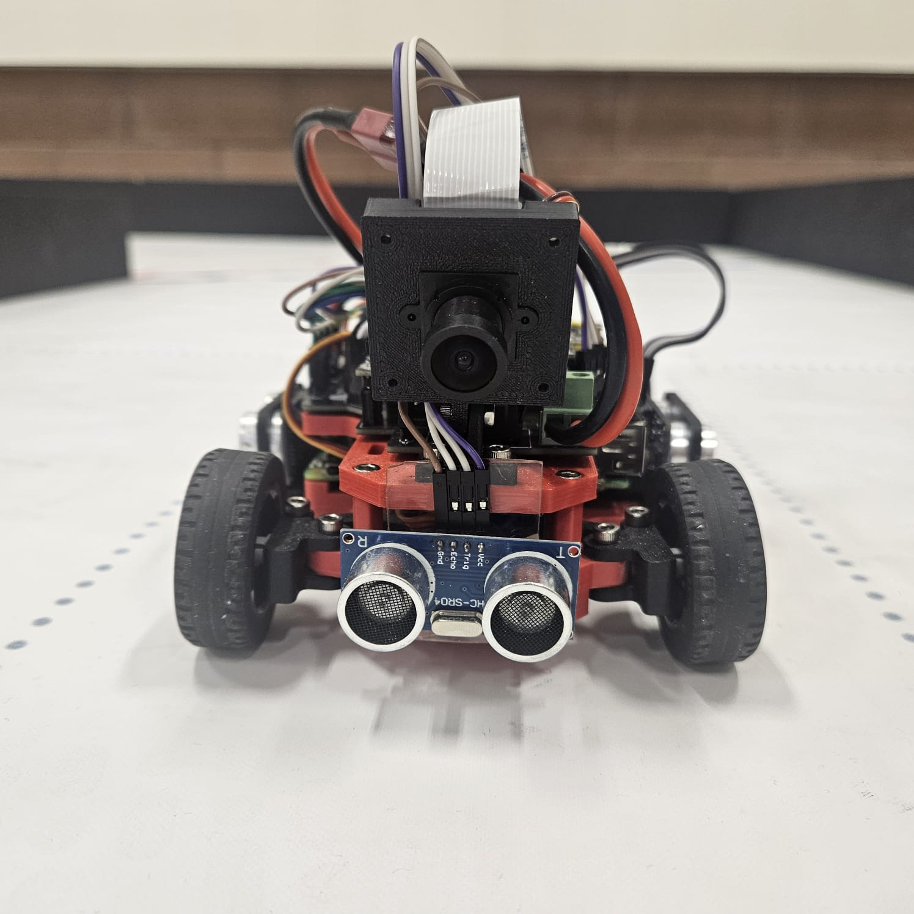
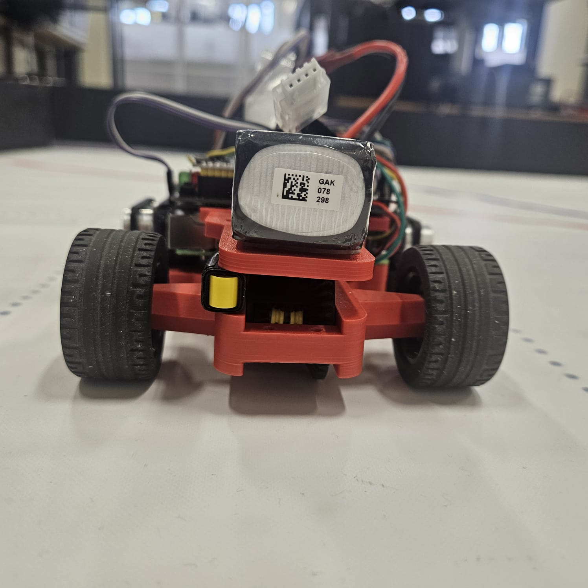
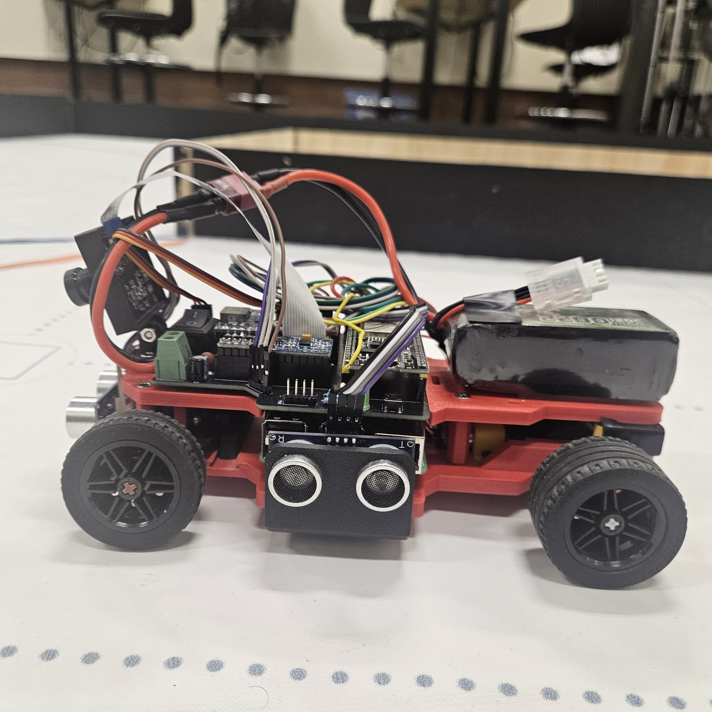
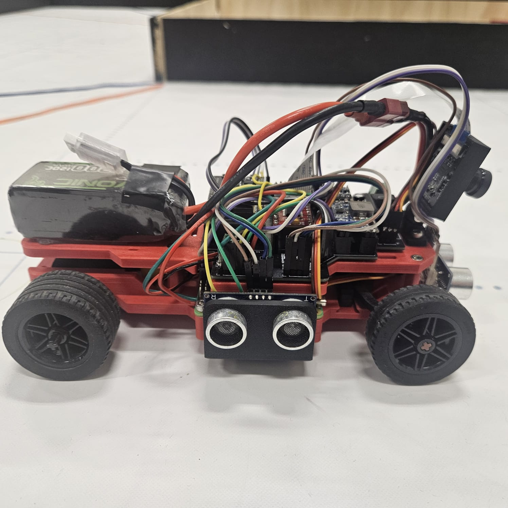
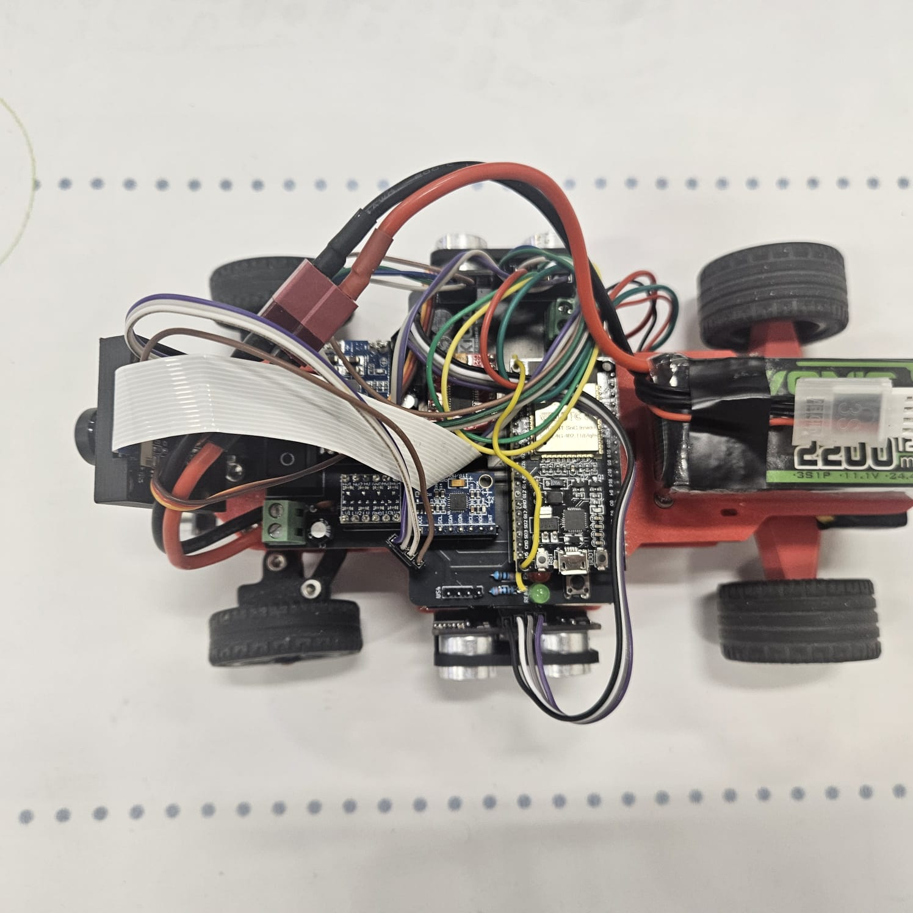
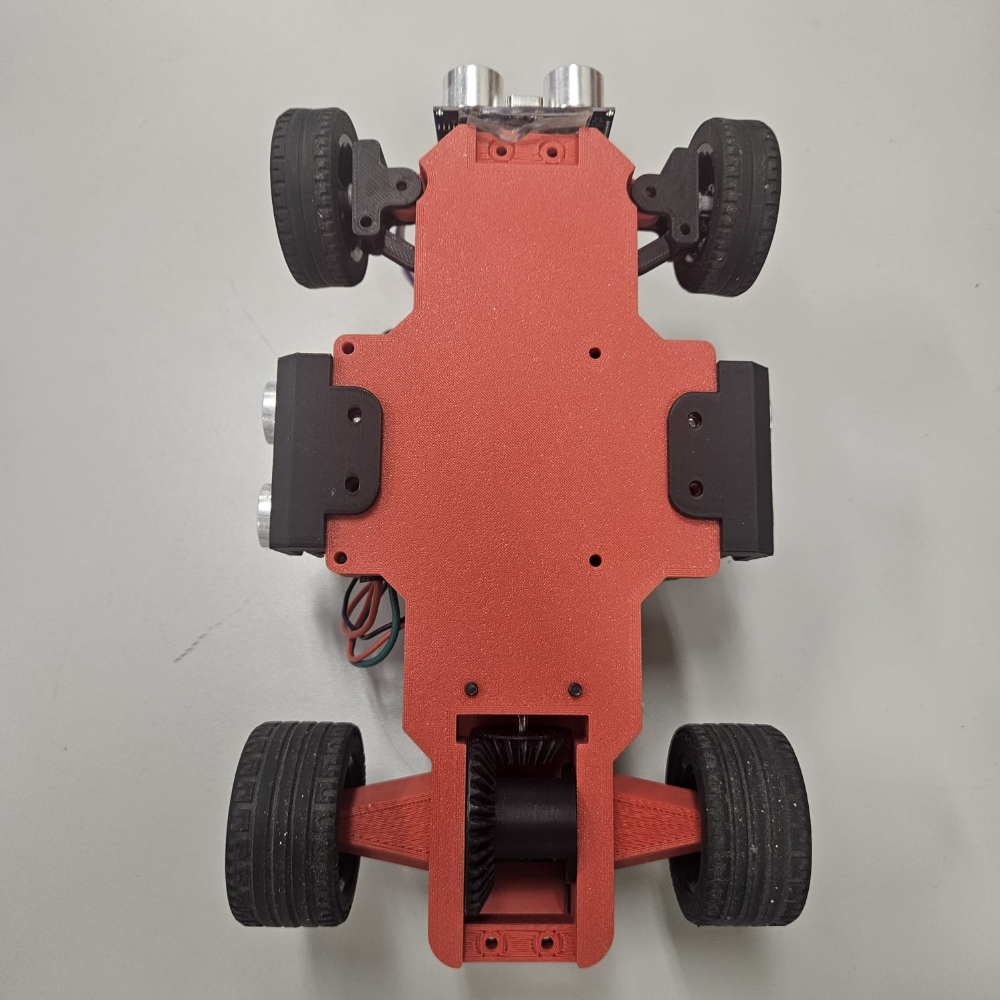
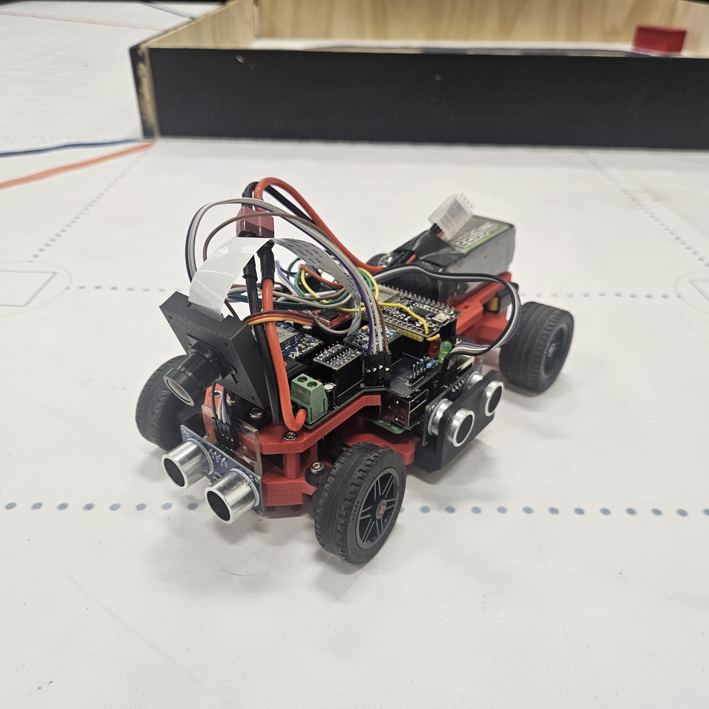

# WRO 2026 — Future Engineers | Self-Driving Car

> **Team:** FoxRobotics
> **| Members:** Erick Blanco · Jesse Banda · Cesar Ahumada
> **| Coach:** Daniel Millan
> **| Country / Region:** México — Baja California
> **| Season:** 2026

---

## Table of Contents

1. [Vehicle Overview](#1-vehicle-overview)
2. [Mechanical Design & Mobility](#2-mechanical-design--mobility)
3. [Power Architecture & Sensors](#3-power-architecture--sensors)
4. [Software Architecture](#4-software-architecture)
5. [Systemic Thinking & Engineering Decisions](#5-systemic-thinking--engineering-decisions)
6. [How to Build & Run](#6-how-to-build--run)
7. [Repository Structure](#7-repository-structure)
8. [Videos](#8-videos)
9. [Photos](#9-photos)

---

# 1. Vehicle Overview

Our vehicle is a custom-built autonomous car for the WRO 2026 Future Engineers — Self-Driving Cars challenge. It completes 3 laps around a randomized track, and in the Obstacle Challenge it also detects and correctly passes coloured traffic-sign pillars (**red → keep the pillar on the car's left / pass on its right; green → keep it on the right / pass on its left**) before parking at the end.

The car uses **two controllers working together**: a Raspberry Pi 4 runs the camera vision pipeline and the high-level path planner (Pure Pursuit), and an ESP32 runs the real-time control loop, the state machine and all the actuators. They talk over a UART link with a small line-based protocol ("V2"). This split is the central architectural decision of the project and is explained in [Section 4](#4-software-architecture) and [Section 5](#5-systemic-thinking--engineering-decisions).

**Key specifications:**

| Parameter | Value |
|---|---|
| Dimensions | 210 × 140 × 80 mm |
| Weight | 564 g |
| Drive type | Rear-wheel drive (RWD) |
| Steering | Ackermann rack-and-pinion, SG90 servo |
| High-level controller | Raspberry Pi 4 Model B (vision + Pure Pursuit) |
| Real-time controller | ESP32 DevKit (FSM, PID, motor & sensor I/O) |
| Inter-controller link | UART @ 115200 baud, line protocol "V2" (see §4.6) |
| Vision | Raspberry Pi Camera v2 (FOV ≈ 62°), processed at 640 × 480 |
| Distance sensors | HC-SR04 (5V) × 3 — left, right, front — via 5V↔3.3V level shifter |
| IMU | MPU-6050 (gyroscope + accelerometer) |
| Drive motor | N20 DC gear motor (50:1) + 2:1 LEGO stage → 100:1 total |
| Motor driver | TB6612FNG |
| Battery | 3S LiPo 11.1 V 2200 mAh |
| Logic power | MINI560 step-down, 5 V |

# Bill of Materials (BOM)

---

## Custom Manufactured Parts

| ID | Component | Description | Quantity | Supplier | Approximate Cost |
|---|---|---|---|---|---|
| 1 | BaseChasis | Main body of the vehicle. | 1 | Custom made, 3D printed | 1.6 USD |
| 2 | TopShell | Upper part of the vehicle. | 1 | Custom made, 3D printed | 1 USD |
| 3 | Cremallera | Rack used for steering. | 1 | Custom made, 3D printed | 0.1 USD |
| 4 | ServoGearDirection | Pinion for the steering system, directly connected to the servo. | 1 | Custom made, 3D printed | 0.5 USD |
| 5 | LinkageDirection | Linkage between the rack and steering knuckle. | 2 | Custom made, 3D printed | 0.05 USD |
| 6 | SteeringKnuckle | Allows lateral wheel movement for steering. | 2 | Custom made, 3D printed | 0.15 USD |
| 7 | DCsupport | Holds the DC motor in place. | 1 | Custom made, 3D printed | 0.05 USD |
| 8 | RingDifferential | Main driven gear of the differential that transfers power to the axle assembly. | 1 | Custom made, 3D printed | 0.25 USD |
| 9 | PlanetDifferential | Allows torque distribution between both wheels while enabling different wheel speeds during turns. | 2 | Custom made, 3D printed | 0.1 USD |
| 10 | PinionDifferential | Transfers rotational motion from the motor to the differential gear system. | 1 | Custom made, 3D printed | 0.1 USD |
| 11 | SunDifferential | Transfers torque from the differential gears to the wheel axle. | 2 | Custom made, 3D printed | 0.1 USD |
| 12 | CameraBase | Holds the camera frame in place. | 1 | Custom made, 3D printed | 0.1 USD |
| 13 | CameraBack | Rear section of the camera frame. Connects to the CameraBase. | 1 | Custom made, 3D printed | 0.1 USD |
| 14 | CameraFront | Camera frame. | 1 | Custom made, 3D printed | 0.2 USD |
| 15 | UltrasonicSupport | Holds an ultrasonic sensor in place (used for the left, right and front sensors). | 3 | Custom made, 3D printed | 0.3 USD |

---

## LEGO Components

| ID | Component | Description | Quantity | Supplier | Approximate Cost |
|---|---|---|---|---|---|
| 16 | Lego 6135494 | Front wheel axle. | 2 | LEGO | 0.8 USD |
| 17 | Lego 4535768 | Rear wheel axle. | 2 | LEGO | 1 USD |
| 18 | Lego 6121485 | Reduces friction on the rear wheels. | 2 | LEGO | 0.4 USD |
| 19 | Lego 4299389 | Rim for rear wheels. | 2 | LEGO | 1.2 USD |
| 20 | Lego 4184286 | Tires for rear wheels. | 2 | LEGO | 3.5 USD |
| 21 | Lego 6251174 | Rim for front wheels. | 2 | LEGO | 1.2 USD |
| 22 | Lego 6182551 | Tires for front wheels. | 2 | LEGO | 3.82 USD |

---

## Electronics

| ID | Component | Description | Quantity | Supplier | Approximate Cost |
|---|---|---|---|---|---|
| 23 | ESP32 | Real-time controller: sensor I/O, cascade PID, finite state machine, actuator PWM. | 1 | Unit Electronics | 8 USD |
| 24 | Raspberry Pi 4 Model B | High-level controller: computer vision and Pure Pursuit path planning. | 1 | Amazon | 60 USD |
| 25 | Mini560 5V | Step-down regulator powering the Raspberry Pi, ESP32 and peripherals. | 1 | Amazon | 6 USD |
| 26 | MPU 6050 | 6-axis IMU used to measure angular velocity and integrate heading. | 1 | Unit Electronics | 3 USD |
| 27 | HC-SR04 | Ultrasonic distance sensors — left, right (wall following) and front (obstacle-round cornering). | 3 | Unit Electronics | 10.5 USD |
| 28 | Level Shifter | Logic-level converter for the 5 V HC-SR04 echo lines into the 3.3 V ESP32. | 1 | Unit Electronics | 7 USD |
| 29 | Driver TB6612FNG | Motor driver controlling speed and direction of the DC drive motor. | 1 | Unit Electronics | 5 USD |
| 30 | RaspiCamera V2 | Camera module used for computer vision. | 1 | Amazon | 10 USD |
| 31 | Custom PCB | Printed circuit board for power distribution and electronic connections. | 1 | JLCPCB | 5 USD |

---

## Power System

| ID | Component | Description | Quantity | Supplier | Approximate Cost |
|---|---|---|---|---|---|
| 32 | Ovonic 2200mAh 3S | 3-cell LiPo battery powering the robot's electronics and drive system. | 1 | E-Bay | 13 USD |

---

## Actuators

| ID | Component | Description | Quantity | Supplier | Approximate Cost |
|---|---|---|---|---|---|
| 33 | N20 with 50:1 reduction | DC gear motor providing torque for robot movement. | 1 | Unit Electronics | 6 USD |
| 34 | SG90 Servo | Micro servo motor used for steering control. | 1 | Unit Electronics | 6 USD |

---

## Fasteners

| ID | Component | Description | Quantity | Supplier | Approximate Cost |
|---|---|---|---|---|---|
| 35 | M3 Screws | Used for structural assembly and component mounting. | 23 | Local Hardware Store | 1 USD |
| 36 | M3 Nuts | Used to secure structural and electronic components. | 1 | Local Hardware Store | 0.05 USD |
| 37 | M2 Nuts | Used to secure servo motor and servo pinion | 3 | Local Hardware Store | 0.15 USD |

## Total Estimated Cost

| Total |
|---|
| ~155 USD |


---

# 2. Mechanical Design & Mobility

### 2.1 Chassis selection

The chassis was designed from scratch to fit all the components we needed for competition. We printed it in red and black SUNLU PLA on a Bambu Lab A1, keeping the structure as light as possible without sacrificing the rigidity the drivetrain and electronics require.

For wheel transmission shafts, we used LEGO axles throughout: part 6135494 for the front and part 4535768 for the rear. This wasn't an aesthetic choice — LEGO axles have much better dimensional consistency than fully printed shafts, which flex under load and cause alignment issues. We also added LEGO bushings (6121485) to the rear axle to cut down on friction between moving parts.

| Component   | Material / Part | Purpose                 |
| ----------- | --------------- | ----------------------- |
| Chassis     | SUNLU PLA       | Main robot structure    |
| Front Axles | LEGO 6135494    | Power transmission      |
| Rear Axles  | LEGO 4535768    | Rear drivetrain support |
| Bushings    | LEGO 6121485    | Friction reduction      |
| Printer     | Bambu Lab A1    | Manufacturing process   |

We used PLA because it prints fast, doesn't warp like ABS, and is stiff enough for indoor competition conditions. PETG has better impact resistance and ABS handles heat better, but neither of those properties matters much for a robot running on a flat mat indoors. What did matter was being able to iterate quickly and get consistent parts, and PLA delivered on both.

### 2.2 Wheels

We tested several wheel options before settling on LEGO parts. The rear wheels use rim 4299389 with tire 4184286, and the front uses rim 6251174 with tire 6182551. Both have a 43 mm outer diameter, which keeps the ride height even front to rear.

Since the drivetrain already uses LEGO axles, LEGO-compatible rims were the obvious fit — they mount directly without adapters, which removes a potential source of wobble at the wheel interface.

The 43 mm diameter was also validated against our motor RPM target. At our gear ratio, this diameter puts normal operation in the 40–70% PWM range, which gives us enough resolution for smooth speed control. A noticeably larger wheel would push operating duty cycles above 85% and compress the usable throttle range.

We ran the car at full throttle on the competition mat surface and saw no detectable slip at the rear. The LEGO rubber compound grips the white matte WRO field without any prep needed.

### 2.3 Drive system (torque vs. speed analysis)

The main drive is an N20 DC motor with a 50:1 internal gearbox — compact at 12 × 10 × 26 mm and still enough torque for a ~1.5 kg vehicle. Between the motor output shaft and the differential, we added a 2:1 LEGO gear stage, bringing the total drivetrain reduction to **100:1** and estimated rear axle torque to about 1.76 kg·cm.

**Why 100:1 and not just 50:1?**

We ran the 50:1 configuration first. It was faster, but corner exits were inconsistent — the rear wheels would occasionally lose traction under acceleration, causing yaw disturbances the PID couldn't fully catch. At 100:1, top speed dropped but torque delivery became smooth and predictable all the way through the speed range. Corner exits became repeatable, which turned out to be a prerequisite for reliable PID tuning.

The ratio also keeps the motor in its efficient RPM band during most of the run, which matters because the motor shares a power source with the logic rail.

The car completes all three Open Challenge laps in about 12 seconds at just 60% motor speed. That headroom is useful if we need to push speed in later iterations.

**The takeaway:** we prioritized consistency over raw speed. A robot that reliably finishes 3 laps scores more than one that's faster but unpredictable.

### 2.4 Steering — rack-and-pinion with Ackermann geometry

Steering is controlled by an SG90 servo connected to both front knuckles through a rack-and-pinion mechanism with symmetric tie rods.

**Mechanism specs:**

| Parameter | Value |
|---|---|
| Servo | SG90 (0°–180° range) |
| Firmware straight-ahead trim | 80° (servo-horn spline offset; `centroServo` in firmware) |
| Pinion | Module 1, 14 teeth |
| Pinion pitch diameter | 14 mm (dp = m × z = 1 × 14) |
| Pinion outer diameter | 16 mm (dp + 2×addendum = 14 + 2) |
| Rack | Module 1, 11 teeth, 27.5 mm total travel |
| Rack displacement per servo degree | 0.1222 mm/° |
| Transmission ratio | 2.50° servo : 1° wheel |
| Geometric wheel steering range | ±43° from center |
| Firmware-clamped servo command | 20°–150° (≈ ±35° usable at the wheel) |

**Kinematic analysis:**

The 14 mm pitch diameter gives a pitch circumference of 43.98 mm. Each degree of servo rotation moves the rack 0.1222 mm. At 90° per side from center, the rack travels 11.00 mm per side — producing ±43° at the front wheels.

The outer diameter of 16 mm confirms the module (d_outer = dp + 2×m = 14 + 2 = 16 mm).

The 2.50:1 ratio reduces steering sensitivity at the wheel, which gives the inner control loop finer resolution at its update rate. A lower ratio would make steering response too abrupt.

The firmware never commands the full mechanical range: `escribirServo()` is clamped to 20°–150° (about ±35° at the wheel) so a saturated control output can't drive the rack into its physical end stop. That still clears the tightest Open-Challenge corridor (600 mm) and the maneuvering the Obstacle Challenge needs.

**Why rack-and-pinion over a direct servo arm?**

A direct arm only controls one wheel directly. The opposite knuckle, linked by a fixed-length tie rod, gets an angle that's geometrically correct only at center — producing toe error everywhere else. The rack pushes both tie rods symmetrically, so both wheels get the right angle at every steering position. Combined with the Ackermann geometry of the knuckles, each wheel tracks its own correct turning radius. No lateral scrub, and steering response is linear across the full range.

---

# 3. Power Architecture & Sensors

### 3.1 Power budget

The whole vehicle runs off an Ovonic 2200mAh 3S LiPo. Power splits two ways: the motor driver takes battery voltage directly for the DC motor, and everything else goes through a MINI560 step-down converter producing a stable 5V at up to 5A.

| Rail | Source | Consumers | Max Current Draw |
|---|---|---|---|
| 5V Logic | MINI560 Step-Down Converter | Raspberry Pi 4 + RaspiCam V2, ESP32, HC-SR04 ×3, MPU6050, SG90 | ~4.0 A |
| Battery / Main Power | Ovonic 2200mAh 3S LiPo | Entire vehicle power distribution | ~35 A discharge capability |
| Motor Power | Motor Driver directly from 3S LiPo | DC drive motor | ~1.6 A peak |
| 3.3V Internal | ESP32 internal regulator | I²C communication and internal ESP32 logic, Level Shifter | ~200 mA |

The Ovonic battery is rated 120C continuous, which is theoretically 264 A. We're drawing about 4.5 A peak — under 2% of its discharge capability. There's no shortage of headroom here.

The Raspberry Pi and the ESP32 share the 5 V rail but the DC motor is fed straight from the battery through the TB6612FNG, so stall-current spikes on the motor never sag the logic supply.

### 3.2 Sensor selection and placement

| Sensor | Purpose | Placement | Notes |
|---|---|---|---|
| Raspberry Pi Camera Module V2 | Lane, corner-line and pillar detection | Front-center, ~15° downward tilt | Main vision system, OpenCV on the Pi |
| HC-SR04 (left) | Left wall distance | Left side of the chassis | Feeds the wall-centering PID |
| HC-SR04 (right) | Right wall distance | Right side of the chassis | Feeds the wall-centering PID |
| HC-SR04 (front) | Distance to the wall ahead when approaching a corner | Front bumper, facing forward | Obstacle round only — triggers the CRUCERO → MANIOBRA sequence |
| MPU-6050 | Heading integration during cornering and recovery | Center of chassis | Gyro Z integrated into `anguloGyro`, echoed back to the Pi |

#### Camera system

The camera handles lane geometry (via a bird's-eye-view transform), the orange corner-line markers, and red/green pillar detection. Image processing runs on the Raspberry Pi 4 with OpenCV in real time and drives the Pure Pursuit planner.

It is mounted front-center with a ~15° downward tilt. We tested a horizontal mount first, but that captured too much background, which slowed detection and added noise. Tilting it down focuses the field of view on the track and the obstacle zone, which cut both false positives and computational load. The exact tilt is baked into the bird's-eye-view homography during calibration (see §4.2), so the mount must not move after calibration.

#### HC-SR04 ultrasonic sensors

The left and right sensors drive lateral positioning and wall following. The **front** sensor was added for the Obstacle Challenge: because that round uses a segmented, stop-and-maneuver turn instead of a continuous arc (see §4.4), the car needs to know how far it is from the wall ahead so it can decide *when* to stop cruising and *which* maneuver (forward arc or reverse pivot) to run.

We originally tested VL53L0X time-of-flight sensors. On paper they win — ±3 mm accuracy versus ±15 mm for the HC-SR04, and a narrower beam. In practice, the black competition walls absorbed their 940 nm IR signal and consistently returned out-of-range readings at 300 mm. The HC-SR04 reflects off any surface regardless of color. We went with reliability over precision and made up the accuracy difference with software filtering (EMA on all three channels, plus a 5-sample median on the front channel to reject spikes before they can trigger a maneuver).

#### MPU-6050 IMU

The MPU-6050 gives heading and rotation data during cornering and recovery. The gyro Z axis is integrated each loop into `anguloGyro`, with a 1°/s deadband to suppress MEMS thermal drift on straights. On startup the firmware averages several hundred stationary samples to compute the gyro bias (`calcGyroOffsets`); if that offset comes back unusually large the firmware halves the integration scale as a safety net. The integrated heading is also sent back to the Pi in every acknowledgement so the vision side can dead-reckon obstacle positions (see §4.3).

---

# 4. Software Architecture

### 4.1 System overview — two controllers, one link

Responsibility is split across two processors by hardware strength:

```
        RASPBERRY PI 4 (Python, OpenCV)                          ESP32 (Arduino / C++)
 ┌───────────────────────────────────────────┐    V2     ┌────────────────────────────────────┐
 │ Camera → BEV homography → floor centerline│   UART    │ readPiSerial()  →  parse V2        │
 │ Pillar detection (HSV) + corner-line track│  ──────►  │                                    │
 │ Rolling obstacle memory (dead reckoning)  │  115200   │ 5-state FSM                        │
 │ Pure Pursuit geometric controller         │           │  SIGUIENDO / GIRANDO / RECUPERANDO │
 │ RECUPERANDO trigger (measured state)      │  ◄──────  │  CRUCERO / MANIOBRA                │
 │ builds one V2 line per processed frame    │  ACK:V2   │ cascade PID (wall + gyro)          │
 └───────────────────────────────────────────┘   ang=    │ servo + motor PWM, HC-SR04, MPU    │
                                               est= dir= └────────────────────────────────────┘
```

- The **Pi** decides *where to steer*: it turns the camera frame into a top-down view, extracts a drivable centerline, runs a Pure Pursuit controller against it, and reduces the result to a single normalized steering value plus a few status flags. It processes 1 of every 3 captured frames (~12–15 Hz effective).
- The **ESP32** decides *how to drive*: it owns the 50 Hz control loop, the finite state machine, corner detection, the recovery behaviour, and every actuator. It treats the Pi's steering value as the primary reference while Pure Pursuit is active, and falls back to its own wall + gyro PID if the Pi goes silent for more than 800 ms.

Why not one processor? Real-time GPIO timing (ultrasonic pulses, servo/motor PWM, gyro sampling) and non-deterministic OpenCV latency don't coexist well on one core. Linux can't guarantee a µs-accurate pulse while an HSV pass is running; a microcontroller can't run OpenCV. Splitting them lets each run at its own natural rate, and a late UART packet just means the ESP32 reuses the last command instead of stalling. This trade-off is analyzed in [Section 5](#5-systemic-thinking--engineering-decisions).

**Where to start reading the code:** the Pi loop is [`pure_pursuit/runtime_nuevo.py`](src/RASPI/cam/pure_pursuit/runtime_nuevo.py) (`run()` → per-frame block); the ESP32 loop is [`PurePursuit.ino`](src/ESP32/PurePursuit/PurePursuit.ino) (`loop()` → the `switch (estado)`). Every module is annotated in [Section 7](#7-repository-structure); tunables live in [`pure_pursuit/config.py`](src/RASPI/cam/pure_pursuit/config.py).

### 4.2 Vision pipeline (Raspberry Pi — `pure_pursuit/`)

Entry point: `pure_pursuit/runtime_nuevo.py`. Per processed frame:

1. **Capture** — a threaded grabber pulls frames from the Pi camera through a libcamera/GStreamer pipeline at 640 × 480 BGR, dropping stale buffers so the loop always sees the newest frame.
2. **Bird's-eye view (`bev.py`)** — a homography (inverse-perspective mapping) warps the camera frame to a top-down 400 × 400 image at 2 mm/px. The homography comes from `bev_calib.npz`, generated once by `calibrate.py` from a **3 × 3 grid of 9 physical floor markers** (RANSAC fit). We use 9 points, not the minimum 4: a 4-point fit is exact and can't detect a mis-click or extrapolate safely beyond the marked area, while 9 points let the solver average out click noise across the full range the centerline actually uses (from just ahead of the car out to ~550 mm).
3. **Pillar detection (`vision.py`)** — HSV masks for red and green, then contour filtering by area, **solidity** (compact blob ≈ 0.7–0.9, painted line < 0.4) and **aspect ratio** (< 2.2) so the mat's coloured lines are not mistaken for pillars.
4. **Centerline (`centerline.py`)** — a floor-colour mask in the BEV, minus inflated "keep-out" disks around each obstacle. The keep-out is **asymmetric per the WRO rule**: a red pillar inflates further to its *left* (car passes on the right), a green pillar further to its *right*. Rows are sampled bottom-to-top; each row blends the free-gap center with the WRO pass-side using a weight that ramps up as the car nears the can (not a binary switch). A 1-D moving average plus a per-step Δx clamp keep the path within the servo's curvature limit.
5. **Pure Pursuit (`controller.py`)** — a geometric pure-pursuit controller in BEV pixel space. Look-ahead is **adaptive**: it shrinks from 100 px toward 78 px as the nearest can closes *longitudinally*, so the car keeps translating and arcs around the can instead of pivoting in place. Output is slew-limited to 6°/frame to kill frame-to-frame steering whip.
6. **Serialize** — the steering angle is normalized (`obs = steer_deg / 60`) and packed into one V2 line with the status flags (§4.6).

#### How the Pure Pursuit controller works

Pure Pursuit is a path-tracking method: instead of reacting to an *error signal*, the controller looks a fixed distance ahead along the path — the **look-ahead** — picks the point on the centerline at that distance, and computes the single steering angle whose turning arc, starting from the car's current pose, passes exactly through that point. Every frame the target point moves forward along the centerline and the car "chases" it, so the trajectory is always a smooth arc onto the path rather than a hand-tuned reaction curve.

```
          centerline (from BEV)                 look-ahead point picked at
        ·····•·····•·····•···•···•  ← target    distance  ld  along the path
                            ╲
                             ╲  arc the steering angle produces
              ┌───┐           ╲
              │car│────────────•   robot pose (rear axle = reference)
              └───┘
                 └─ α = bearing to target,  steer = atan2(2·L·sin α, ld)
```

Why it fits this problem:

- The vision pipeline already produces a **path** (the centerline), not a point to servo onto — Pure Pursuit consumes that path directly.
- The look-ahead is a single, physically meaningful tuning knob: **short = cut hard toward the path** (fast dodge), **long = ease onto it** (smooth cruise). That is exactly the behaviour the obstacle logic needs, so avoidance is folded into the *same* controller by shrinking the look-ahead near a can instead of adding a separate avoidance mode.
- It degrades gracefully: a noisy or short path just moves the target point a little; there is no integrator to wind up and no error term to spike.

```python
dx = target[0] - robot_x          # lateral offset to the look-ahead point (BEV px)
dy = robot_y - target[1]          # forward distance to it
ld = max(1.0, math.hypot(dx, dy)) # actual chord length
alpha     = math.atan2(dx, dy)                                   # bearing to the point
steer_rad = math.atan2(2.0 * C.WHEELBASE_PX * math.sin(alpha), ld)  # pure-pursuit arc
steer_deg = math.degrees(steer_rad)

if bev_obstacles:                                   # a can is in play
    steer_deg *= self._distance_steer_gain(...)     # ramp 0.30→1.0 as it closes
steer_deg = max(-C.MAX_STEER_DEG, min(C.MAX_STEER_DEG, steer_deg))
steer_deg = clamp(steer_deg, prev ± C.PP_STEER_SLEW_DEG)   # 6°/frame slew limit
```

`adaptive_lookahead` shrinks the look-ahead from 100 px toward 78 px, and `_distance_steer_gain` ramps the steering scale from 0.30 up to 1.0, both as the nearest can closes. Both key off the **longitudinal** distance to the can (forward gap), not the Euclidean one: a can still off to the side but level with the car used to keep those values relaxed, and the car drove straight past the point where it should have started turning. The WRO pass-side bias (right of red, left of green) is *not* handled here — it is already baked into the centerline by `centerline.py`, so the controller only has to follow the path it is given.

If `bev_calib.npz` is missing, the runtime falls back to a simple reactive PID on the pillar's x-position in the raw frame (`RED_TARGET_PX` / `GREEN_TARGET_PX`) so the car is never left without a controller.

### 4.3 Obstacle handling (Obstacle Challenge)

**Rolling obstacle memory (`obstacle_memory.py`).** The BEV only contains what the camera sees *now*; as the car closes on a can, the can leaves the bottom of the frame, its keep-out disc vanishes, and the centerline snaps back to center — cutting the corner onto the can. The memory fixes this: seen cans are stored as `(x, y, colour, confidence)` in robot-relative BEV coordinates and, every frame, the ego-motion is applied to every remembered can — forward travel from an assumed speed, rotation from the **real IMU heading change** in the ESP32 acknowledgement:

```python
dheading = heading_deg - self._prev_heading          # real Δ from the ACK, degrees
ds_px    = (C.ROBOT_SPEED_MMS * dt_s) / C.MM_PER_PX  # assumed forward advance, BEV px
# a hard dodge rotates the car without translating it — shrink ds_px when |dheading| is large
ds_px   *= turn_brake(dheading)
self._advance(ds_px, dheading)     # each can: y += ds_px, then rotate −dheading about the robot
```

Fresh detections are merged in, unseen cans decay in confidence and are pruned once genuinely passed. The inflated keep-out therefore persists until the car has physically cleared the can. The `heading_deg` this relies on is exactly the value the ESP32 integrates for its own control (see §4.5) and echoes back — one shared heading, so the map rotates by the same angle the car actually turned.

**"Mine" vs "beyond the corner" (`corner_lines.py`).** The mat's orange corner lines are tracked row-by-row in the BEV. Each remembered can is classified as *mine* (on my straight, must be avoided) or *beyond* (on the next straight, ignore for now), with asymmetric hysteresis — quick to start avoiding, slow to stop — because starting to dodge is the safe side of a wrong call.

**Far hint (`far_hint.py`).** A PD controller on a pillar's offset in the *raw* camera frame (before it projects into the BEV range) nudges the steering to pre-center on a distant can, capped at ±12° so it can only hint, never dodge.

**Mid-turn detector (`mid_turn.py`).** While the ESP32 is turning, the rolling memory is disabled (its motion model assumes forward travel, which a pivot violates). This detector instead uses only the raw per-frame BEV projections and requires a same-colour can in a consistent position across several frames inside a close forward cone to "confirm" it. **Phase 1 (current): observe and log only** — it writes `[MTURN]` lines to the journal and does not yet change steering, so we can measure its reliability on-track before wiring it into the firmware.

#### Triggering RECUPERANDO from the obstacle memory

**The problem.** When the car has to swing wide around a can with no room to spare, it finishes the pass **crooked** — pointing 30–60° off the straight — and often with one wall out of ultrasonic range. At that exact moment the camera view is the least trustworthy (the centerline is short and skewed), so letting Pure Pursuit "straighten itself" from what it sees tends to over- or under-correct into a wall. The fix is to hand the wheel to the ESP32's wall + gyro PID (state `RECUPERANDO`) until the chassis is realigned — but *only* for a hard dodge. A gentle dodge with space to spare straightens itself fine and should not stop for a recovery.

**The trigger** (`_measured_recup_trigger` in [`runtime_nuevo.py`](src/RASPI/cam/pure_pursuit/runtime_nuevo.py)) does not dead-reckon the can itself — it reads the state the obstacle memory and the IMU already provide, and needs three things to line up:

```
1. ARM   a real dodge is in progress:
         the centerline's avoidance weight near the car's axis has been
         ≥ RECUP_MEAS_ARM_W for RECUP_MEAS_ARM_FRAMES straight frames.
         On arming, snapshot heading_ref = current heading (the straight's heading).

2. CLEAR the memory no longer places any Red/Green can both far enough ahead
         of the axis AND close enough to the side to be in the way
         (going straight, the car's edge would clear it) — held for
         RECUP_MEAS_CLEAR_FRAMES frames (or just 1 if a corner is imminent).

3. SKEW  |heading − heading_ref| ≥ RECUP_MEAS_HEADING_DEG   (25°)
         → there is actually something to straighten.

ARM && CLEAR && SKEW  →  emit pasado=1  (one-frame pulse)  →  ESP32 enters RECUPERANDO
CLEAR but never SKEW for RECUP_MEAS_GENTLE_FRAMES  →  disarm quietly, no RECUPERANDO
```

Condition 3 is what separates the two cases: same "can is now behind me" geometry, but only the crooked one triggers a recovery. The trigger disarms on fire, so it emits **once per dodge** — a can that lingers in memory while the ESP32 straightens can't re-fire it. The can positions it checks are the same `(x, y)` the memory maintains — corrected by fresh detections while the can is visible, and carried by the *same* ego-motion the centerline uses once it isn't (see the memory snippet above) — so the trigger and the path always agree on where the can is.

This replaced an earlier approach that anchored the can's position when first seen and dead-reckoned it forward with an *assumed* speed and a bicycle model; that anchor drifted 200–400 mm within 1–2 s and fired either early (nose into the can) or far too late.

### 4.4 ESP32 finite state machine (`src/ESP32/PurePursuit/PurePursuit.ino`)

```
enum Estado { SIGUIENDO, RECUPERANDO, GIRANDO, CRUCERO, MANIOBRA };
```

| State | Role |
|---|---|
| **SIGUIENDO** | Normal driving. Steering = Pi's Pure Pursuit value, blended with a light gyro correction (weight 0.12) and, only on a clean straight, the wall PID (weight 0.30). Watches for the next corner and for obstacle flags from the Pi. |
| **GIRANDO** | Continuous 90° corner (**Open round only**). Servo held at full lock, motor speed ramped down in steps as `|anguloGyro|` grows, exits at `|anguloGyro| ≥ 90°`. The first corner latches the track's turn direction from whichever wall opened up. 12 corners = 3 laps → race finished. |
| **RECUPERANDO** | Entered on the Pi's `pasado=1` pulse. Vision is handed off; wall PID + gyro PID (with widened limits) straighten the chassis back into the lane. Exits when the heading error settles (with a timeout safety net for corners where one wall legitimately reads "open"). |
| **CRUCERO** | *(Obstacle round)* Straight is clean and a corner is near (front sensor < 80 cm). The car drives straight on heading toward the wall: far away, vision keeps the centerline straight; once inside `CRUCERO_GYRO_CM`, control is pure gyro + wall PID. A new obstacle sends it back to SIGUIENDO. |
| **MANIOBRA** | *(Obstacle round)* Replaces the continuous turn. At 30–60 cm from the wall a one-time decision is latched: **turn direction** = the side whose wall is open; **forward arc vs. reverse pivot** = chosen from the distance to the *outer* wall of the turn (tight against it → reverse pivot; room to swing → forward arc). A multi-phase sub-machine runs it, with motor-**coast** phases inserted between every direction reversal (plugging the H-bridge under load destroyed a TB6612 during testing). An optional short straight back-off afterward buys room on the new straight. Then it straightens, zeroes the heading for the new straight, counts the turn and returns to SIGUIENDO. |

The turn-direction is latched once (all corners of a WRO track turn the same way); the forward-vs-reverse choice is made fresh at every corner from the distance to the **outer** wall of the turn ([`decidirManiobra()`](src/ESP32/PurePursuit/PurePursuit.ino)):

```cpp
// outer wall = the one that is NOT the opening (right turn → left wall, and vice-versa)
long distExt = maniobraGirarDer ? distL : distR;
maniobraReversa   = (distExt >= HUG_CM);                    // room to swing → reverse pivot
maniobraRetroceso = (distExt >  MANIOBRA_BACKOFF_MIN_CM);   // slack → short back-off after
```

**One flag switches the turn strategy:** `const bool rondaObstaculos` at the top of `PurePursuit.ino` — `true` for the Obstacle Challenge (CRUCERO/MANIOBRA), `false` for the Open Challenge (continuous GIRANDO). Everything else is shared.

### 4.5 Cascade PID (always running underneath)

Even in Pure Pursuit mode the ESP32 computes its dual cascade PID every loop — it is the fallback, the RECUPERANDO/CRUCERO controller, and the blend term in SIGUIENDO.

```
                ┌────────────────────┐   heading    ┌────────────────────┐
  distL─distR ─►│     OUTER PID      │─ setpoint ──►│     INNER PID      │──► servo
                │   (wall centering) │              │  (heading control) │
                └────────────────────┘              └────────────────────┘
                         ▲                                    ▲
                  HC-SR04 readings                    MPU-6050 heading
```

The single-loop `error = distL − distR` controller it replaced failed past ~30° of yaw: the HC-SR04's conical beam hits the wall obliquely, both sensors over-report, the difference sits near zero while the car drifts into a wall. The outer loop turns lateral wall error into a target heading; the inner loop drives the servo to that heading using the IMU, which doesn't care about beam geometry.

**Tuned gains:** `KpWall 1.0 / KiWall 0.0 / KdWall 1.2`, `KpGyro 2.0 / KiGyro 0.0 / KdGyro 0.5`. Both integral terms are **disabled on purpose** — integral built up on long straights and released as a large steering impulse at corner entry, overshooting into the opposite wall. The derivative terms give enough steady-state correction on their own. Raw ultrasonic reads pass through an EMA filter (`alpha = 0.85`) before the PID.

```cpp
// OUTER: lateral wall error → steering contribution (Ki = 0)
errorWall  = constrain(distL - distR, -50, 50);
outputWall = KpWall*errorWall + KdWall*(errorWall - prevErrorWall)/dt;

// INNER: heading error vs. the straight's reference heading (Ki = 0)
errorGyro  = anguloObjetivo - anguloGyro;
outputGyro = KpGyro*errorGyro + KdGyro*(errorGyro - prevErrorGyro)/dt;

// SIGUIENDO with Pure Pursuit active: the Pi's steer leads, PID only trims a clean straight
servo = centroServo - (steerDeg - outputGyro*PP_GYRO_BLEND - outputWall*PP_WALL_BLEND);
// fallback / RECUPERANDO / CRUCERO-near-wall: PID alone
// servo = centroServo + (outputWall + outputGyro);
```

Heading is integrated on the ESP32 from the gyro Z axis, with the 1°/s deadband that keeps MEMS thermal noise from drifting the straight-line heading:

```cpp
float gz = mpu.getGyroZ() / gyroScale;
if (abs(gz) < 1.0) gz = 0;        // 1°/s deadband
anguloGyro += gz * dt;            // this is the value echoed back to the Pi
```

### 4.6 Inter-controller protocol ("V2")

One line per processed frame, newline-terminated, 115200 baud.

**Pi → ESP32:**

```
V2,obs=+0.123,turn=0,state=pp,prio=1,mem=18,pp=1,pasado=0,intr=0
```

| Field | Meaning |
|---|---|
| `obs` | Normalized steering, `steer_deg / 60`, range −1…+1 (`+` = right). |
| `turn` | Legacy directional hint — always `0`; turn direction is resolved on the ESP32 side. |
| `state` | Human-readable label for the journal (e.g. `pp`, `avoid_red`). |
| `prio` | `1` = an obstacle is actively being avoided → **ESP32 must not start a corner turn**. |
| `mem` | Frames of obstacle memory still live → also blocks corner detection while `> 0`. |
| `pp` | `1` = Pure Pursuit steering is authoritative (suspend the wall PID). |
| `pasado` | One-frame pulse: the Pi confirms the car has *physically* cleared an obstacle → enter RECUPERANDO. |
| `intr` | Interior-pass flag (disabled by default). |

**ESP32 → Pi:**

```
ACK:V2,ang=12.34,est=S,dir=L,...debug...
```

| Field | Meaning |
|---|---|
| `ang` | Integrated IMU heading `anguloGyro` (degrees); resets to 0 at each turn. |
| `est` | FSM state — `S` SIGUIENDO, `G` GIRANDO **or** MANIOBRA, `R` RECUPERANDO, `C` CRUCERO. |
| `dir` | Track turn direction — `?` until the first turn, then `L` / `R`. |

### 4.7 Startup handshake

1. Pi lights the LED on **GPIO 27** — "Pi is up".
2. Pi waits for the start button on **GPIO 17**.
3. Camera warm-up (~40 frames discarded to settle exposure).
4. Pi sends `READY` ×3; the ESP32 has been blocking in `setup()` waiting for it.
5. ESP32 replies `ACK:READY`, then **holds the motor at zero until the first real V2 line arrives** (a gate so the car never rolls forward on the fallback PID before Pure Pursuit is actually streaming).
6. Main loop runs until 12 turns are counted.

### 4.8 Development status

| Module | Challenge | Status |
|---|---|---|
| BEV homography + 9-point calibration tool | both | Complete |
| Floor centerline extraction | both | Complete |
| Pure Pursuit geometric controller | both | Complete, track-tuned |
| ESP32 cascade PID + fallback | both | Complete |
| Continuous corner turn (GIRANDO) | Open | Complete, track-tuned |
| Pillar detection (HSV + shape filter) | Obstacle | Complete |
| Asymmetric WRO keep-out in centerline | Obstacle | Complete |
| Rolling obstacle memory (dead reckoning) | Obstacle | Complete, track-tuned |
| Corner-line "mine / beyond" classifier | Obstacle | Complete |
| Measured-state RECUPERANDO trigger | Obstacle | Complete, track-tuned |
| Segmented turn (CRUCERO → MANIOBRA) | Obstacle | Implemented, tuning on track |
| Mid-turn cone detector | Obstacle | Phase 1 — logging only |
| Parking maneuver | Obstacle | In development |

---

# 5. Systemic Thinking & Engineering Decisions

### 5.1 Subsystem interaction map

```
  [HC-SR04 L/R] ─dist─► OUTER PID ─heading_sp─► INNER PID ─┐
  [HC-SR04 F]   ─dist───────────────► CRUCERO/MANIOBRA ────┤
  [MPU-6050]    ─heading──────────────────────────────────►├─► servo + motor
                       │                                    │
  [Pi camera] ─► BEV ─► centerline ─► Pure Pursuit ─obs────►┤
                       │                    ▲               │
                       └─ obstacle memory ◄─┴─ ACK: heading ┘
                              │
                       prio / mem / pasado ─► ESP32 FSM transitions
```

The IMU heading is the shared currency: the ESP32 integrates it for its own control *and* ships it back so the Pi's obstacle memory can rotate its map by the exact same angle. Everything the Pi decides reaches the ESP32 as four flags and one number; everything the ESP32 knows about its own state reaches the Pi as three fields. Neither side can stall the other.

### 5.2 Key engineering trade-offs

**Trade-off 1 — one processor vs. two.** One ESP32 would remove the UART protocol, the Linux boot time and the sync logic. But real-time computer vision breaks single-core timing: a 640 × 480 HSV pass is 8–15 ms on the Pi 4, and running it alongside µs-accurate GPIO pulses gives non-deterministic jitter. Splitting by hardware strength (Pi = vision + planning, ESP32 = timing + actuation) lets each run at its own rate; a delayed packet just means the ESP32 reuses the last command. The cost — a protocol to maintain and two codebases — was worth deterministic control.

**Trade-off 2 — VL53L0X ToF vs. HC-SR04 ultrasonic.** ToF wins on paper (±3 mm vs ±15 mm, narrow beam). But the WRO field's matte-black walls absorbed the 940 nm IR and returned out-of-range at 300 mm in our tests. Ultrasonic reflects off anything. We chose reliability and closed the accuracy gap with EMA filtering, a front-channel median filter, and the cascade PID.

**Trade-off 3 — reactive steering vs. geometric Pure Pursuit.** The first vision controller steered proportionally to the pillar's pixel offset. It over-reacted close in and under-reacted far out, and had no model of the car's path. Pure Pursuit against a BEV centerline gives a geometrically correct steering angle for a chosen look-ahead, and the look-ahead becomes a single tuning knob for "how hard to dodge". The cost is the BEV calibration step; the payoff is predictable arcs instead of hand-tuned reaction curves.

**Trade-off 4 — forgetting a can when it leaves the frame vs. a rolling memory.** The honest, stateless option is to only avoid what the camera sees now — but that cuts the corner onto a can the moment it drops out of view. The rolling memory keeps the keep-out alive using dead reckoning (assumed speed + real IMU rotation). The risk it adds — a "ghost" can from accumulated error — is bounded by confidence decay and a prune-on-pass rule, and is the safer failure (dodge a can that's already gone vs. clip one that's still there).

**Trade-off 5 — continuous turn vs. segmented stop-and-maneuver (Obstacle round).** A continuous 90° arc is fast and simple and works well in the Open round. In the Obstacle round, a can placed near the corner mouth turns that blind arc into a coin-flip. The `SectionTurning` design trades speed for certainty: cruise straight to a known distance from the wall (front sensor), stop, then run a deterministic maneuver — a forward arc if there's room, a reverse pivot if the car is tight against the outer wall. It is slower, but every corner becomes repeatable, which is the same principle that drove the 100:1 gear choice.

**Trade-off 6 — forward arc vs. reverse pivot inside MANIOBRA.** A forward arc needs clear space ahead to swing through; a reverse pivot needs the car close to the wall first. Rather than pick one, the firmware measures the distance to the outer wall of the turn and chooses per corner, with a reverse-timeout that bails out into a forward finish if the pivot stalls.

### 5.3 Iteration log (high level)

| Stage | Change | Why | Outcome |
|---|---|---|---|
| v1.0 | Single-loop PID on `distL−distR`, VL53L0X ToF | Baseline | ToF failed on black walls; wall contacts at high yaw |
| v1.1 | VL53L0X → HC-SR04 | IR absorbed by black walls | Reliable wall reads at all distances |
| v1.2 | Removed `Ki` from both PID loops | Integral windup released at corner entry | Corner-entry overshoot eliminated |
| v1.3 | Added cascade PID (outer lateral + inner heading) | HC-SR04 oblique-angle error past ~30° yaw | Wall contacts eliminated |
| v1.4 | EMA filter on ultrasonic reads | Spikes in curved sections | Lateral noise cut |
| v1.5 | Progressive speed ramp + gyro deadband | Corner-exit positioning; MEMS drift on straights | Repeatable corner exits, stable straights |
| v2.0 | Added Raspberry Pi vision + UART "V2" protocol | ESP32 alone can't run OpenCV in real time | Vision and control decoupled, each at its own rate |
| v2.1 | Reactive pillar-offset PID → BEV + Pure Pursuit | No path model; reaction curve hard to tune | Geometric steering; look-ahead as the single knob |
| v2.2 | BEV calibration 4 → 9 points (RANSAC) | 4-point fit was exact, no error rejection | Homography usable over the full centerline range |
| v2.3 | Rolling obstacle memory with IMU-rotated map | Can leaves frame → centerline cuts the corner | Keep-out persists until the can is physically passed |
| v2.4 | Adaptive look-ahead (longitudinal distance) | Short fixed look-ahead made the car pivot, not arc | Car keeps translating and arcs around cans |
| v2.5 | Dead-reckoning "anchor" RECUPERANDO trigger → measured-state trigger | Anchor integrated un-measured speed, drifted 200–400 mm | Recovery fires when the state actually shows a crooked chassis |
| v2.6 (`SectionTurning`) | Continuous turn → segmented CRUCERO/MANIOBRA for the Obstacle round; added front ultrasonic; coast phases in the H-bridge sequence | Blind arc unreliable with a can at the corner mouth; plugging killed a TB6612 | Deterministic corners; tuning on track |

### 5.4 Risk analysis

| Risk | Likelihood | Impact | Mitigation |
|---|---|---|---|
| HC-SR04 spike reading | Medium | Medium — brief PID disturbance | EMA on all channels; 5-sample median on the front channel; cascade inner loop dampens |
| Gyro drift over 3 laps | Low | Medium — heading offset grows | 1°/s deadband; heading zeroed after every turn; startup bias calibration |
| Camera mount shifts after BEV calibration | Low | High — warped top-view, wrong centerline | Rigid printed camera frame; recalibrate if the mount is touched; reprojection-error check in `calibrate.py` |
| Can leaves FOV mid-dodge → ghost obstacle | Medium | Medium — phantom keep-out | Confidence decay; prune-on-pass; memory disabled during turns |
| UART packet delayed by OpenCV load | Medium | Low — one stale command | ESP32 reuses last command; 800 ms timeout → autonomous wall+gyro fallback |
| Corner missed / mis-counted | Low | High — wrong lap count or direction | Conservative thresholds; 2 s cool-down; `prio`/`mem` block detection while dodging; front-sensor debounce in the Obstacle round |
| MANIOBRA runs the car into the outer wall | Medium | High — DQ | Forward/reverse chosen from measured outer-wall distance; reverse-timeout fallback; optional post-maneuver back-off |
| H-bridge damage from direction reversal under load | Low (mitigated) | High — dead driver | Motor-coast phase inserted before every direction change (learned the hard way) |
| Servo driven into its end stop | Low | Low | Firmware clamps servo command to 20°–150° |

---

# 6. How to Build & Run

### 6.1 Hardware requirements

- Raspberry Pi 4 (2 GB+), Raspberry Pi Camera v2
- ESP32 DevKit
- HC-SR04 × 3 (left, right, front) + 5 V↔3.3 V level shifter
- MPU-6050 IMU
- SG90 servo, N20 50:1 DC motor, TB6612FNG driver
- 3S LiPo 2200 mAh, MINI560 step-down
- Start button (Pi GPIO 17), status LED (Pi GPIO 27)

Wiring: `schemes/wiring_diagram.png` and `schemes/schematic.png`; the PCB is the KiCad project under `electrical/WRO_RevA/`.

**Pin map (ESP32):** HC-SR04 L `TRIG 27 / ECHO 32`, R `TRIG 26 / ECHO 35`, F `TRIG 14 / ECHO 33`; motor `PWMA 23 / A1 18 / A2 19`; servo `13`; MPU-6050 on I²C; UART to Pi on `Serial2 RX 17 / TX 16`.

### 6.2 ESP32 firmware

```bash
arduino-cli core install esp32:esp32
arduino-cli lib install "MPU6050_tockn"

# Obstacle Challenge (segmented turns) is the default. For the Open Challenge,
# set  const bool rondaObstaculos = false;  near the top of the sketch.

arduino-cli compile --fqbn esp32:esp32:esp32 src/ESP32/PurePursuit/PurePursuit.ino
arduino-cli upload  -p COM5 --fqbn esp32:esp32:esp32 src/ESP32/PurePursuit/PurePursuit.ino
```

Replace `COM5` with your port. `src/ESP32/Controller_PI/Controller_PI.ino` is the older Open-only firmware, kept for reference.

### 6.3 Raspberry Pi software

```bash
git clone https://github.com/Nakashima26/FoxRobotics.git
cd FoxRobotics
python3 -m venv .venv && source .venv/bin/activate
pip install -r requirements.txt
# System packages (apt, not pip): python3-smbus, libcamera + gstreamer1.0-libcamera
#   (the camera pipeline in vision.open_camera)
# Enable the camera: sudo raspi-config → Interface Options → Camera
```

[`requirements.txt`](requirements.txt) lists the Python runtime dependencies with minimum versions and documents the apt / Arduino packages that live outside pip. To pin the exact set from the competition Pi, run `pip freeze > requirements.lock.txt` there.

### 6.4 Calibration (before each venue)

All commands run from `src/RASPI/cam/`. Full guide: [`pure_pursuit/INSTRUCCIONES.md`](src/RASPI/cam/pure_pursuit/INSTRUCCIONES.md).

```bash
# 1. BEV homography — place 9 floor markers on the 3×3 grid in config.py, then:
python -m pure_pursuit.calibrate          # C to freeze, click P1..P9, S to save → bev_calib.npz

# 2. HSV ranges for the venue lighting — edit pure_pursuit/config.py (floor / orange line)
#    and vision.py (red / green pillars)

# 3. Vision-only sanity check (no ESP32, no motors)
python -m pure_pursuit.test_vision                 # live camera
python -m pure_pursuit.test_vision --video clip.mp4 # recorded clip
```

### 6.5 Run

```bash
cd src/RASPI/cam
python -m pure_pursuit.runtime_nuevo                       # with debug window
python -m pure_pursuit.runtime_nuevo --no-window           # competition (headless)
python -m pure_pursuit.runtime_nuevo --serial-port /dev/serial0 --record-orillas
```

Startup: the LED on GPIO 27 lights → press the button on GPIO 17 → camera warm-up → `READY` handshake with the ESP32 → the car starts. It stops itself after 12 counted turns (3 laps).

### 6.6 Autostart & deployment

```bash
sudo ./scripts/install_autostart_pi.sh
```

installs `deploy/systemd/wro-runtime.service`, which runs `pure_pursuit/runtime_nuevo.py` on boot (headless, with HUD recording to `videos_orillas/`). Logs: `journalctl -u wro-runtime.service -f`.

`.github/workflows/deploy-pi.yml` is a CI job that, on every push to `main`, SSHes into the Pi, runs `git pull`, and restarts the runtime and VNC services.

---

# 7. Repository Structure

```
FoxRobotics/
├── src/
│   ├── RASPI/
│   │   ├── cam/
│   │   │   ├── vision.py                  # OpenCV HSV pillar detection (red / green) + shape filter
│   │   │   ├── wro_runtime.py             # Legacy Open runtime + shared infra
│   │   │   │                              #   (threaded capture, SerialLink, async video writer)
│   │   │   ├── wro.py                     # Legacy challenge / obstacle logic (superseded)
│   │   │   ├── controlPI.py Serial.py DistGyro.py calibration.py   # legacy helpers
│   │   │   ├── pure_pursuit/              #  ← CURRENT competition software
│   │   │   │   ├── runtime_nuevo.py       # Entry point: Pure Pursuit + rolling obstacle memory
│   │   │   │   ├── runtime.py             # Pure Pursuit without the rolling memory
│   │   │   │   ├── config.py              # All tunables — HSV, look-ahead, gains, triggers
│   │   │   │   ├── bev.py / calibrate.py / bev_calib.npz   # Bird's-eye-view homography (9-pt)
│   │   │   │   ├── centerline.py          # BEV floor mask → drivable centerline (asymmetric keep-out)
│   │   │   │   ├── controller.py          # Geometric Pure Pursuit controller (adaptive look-ahead)
│   │   │   │   ├── obstacle_memory.py     # Sparse rolling obstacle map, IMU-rotated dead reckoning
│   │   │   │   ├── corner_lines.py        # Orange corner-line + turn-direction + mine/beyond
│   │   │   │   ├── mid_turn.py            # Cone-during-turn detector (Phase 1: logging only)
│   │   │   │   ├── far_hint.py            # Early steering hint for far pillars
│   │   │   │   ├── planner.py             # Rollout planner (experimental, not in the main loop)
│   │   │   │   ├── test_vision.py / pure_pursuit_sim.py   # bench + offline sim
│   │   │   │   └── INSTRUCCIONES.md       # Calibration + run guide
│   │   │   ├── pista/                     # Track-edge detection / recording
│   │   │   └── _archive/                  # Superseded runtimes
│   │   └── tests/                         # UART diagnostics + kinematic simulation
│   └── ESP32/
│       ├── PurePursuit/PurePursuit.ino    #  ← CURRENT firmware — V2 protocol, 5-state FSM
│       ├── Controller_PI/Controller_PI.ino# Legacy Open-only firmware (cascade PID + 3-state FSM)
│       ├── _archive/                      # Previous firmware iteration
│       └── TestCodes/                     # Per-peripheral bring-up sketches (servo, gyro, motor, US, serial)
│
├── electrical/WRO_RevA/                   # KiCad project — schematic, PCB layout, 3D models
├── schemes/                               # schematic.png, wiring_diagram.png
├── models/
│   ├── CAD/                               # SolidWorks parts + assemblies
│   └── STL/                               # 3D-printable parts
├── deploy/
│   ├── systemd/wro-runtime.service        # Pi autostart → runs pure_pursuit/runtime_nuevo.py
│   └── systemd/wro-vnc.service            # VNC for the live camera view
├── scripts/install_autostart_pi.sh        # Installs the systemd service on the Pi
├── .github/workflows/deploy-pi.yml        # CI: push to main → git pull + service restart on the Pi
├── remote/                                # client/server remote-control helper (bench use)
├── videos_orillas/                        # Recorded HUD run footage (debug)
├── t-photos/                              # Team photos            (pending upload)
├── v-photos/                              # Vehicle photos         (pending upload)
├── video/video.md                        # Competition run video links
├── requirements.txt                      # Pi Python dependencies (+ apt / Arduino notes)
└── README.md
```

---

# 8. Videos

| Challenge | Link |
|---|---|
| Open Challenge — 3 laps autonomous | [YouTube](https://www.youtube.com/watch?v=J5yrJuZZ5P8) |

> Full video index: [`video/video.md`](video/video.md)

---

# 9. Photos

Full-size images are in [`v-photos/`](v-photos/) (vehicle) and [`t-photos/`](t-photos/) (team).

<table>
  <tr>
    <td align="center"><br><b>Front</b></td>
    <td align="center"><br><b>Rear</b></td>
  </tr>
  <tr>
    <td align="center"><br><b>Left side</b></td>
    <td align="center"><br><b>Right side</b></td>
  </tr>
  <tr>
    <td align="center"><br><b>Top</b></td>
    <td align="center"><br><b>Bottom (undercarriage)</b></td>
  </tr>
  <tr>
    <td align="center"><br><b>Isometric</b></td>
    <td align="center"><i>Team photo — <code>t-photos/team.jpeg</code> (pending)</i></td>
  </tr>
</table>

---

## License

This repository is public as required by WRO Future Engineers rules and will remain public for at least 12 months after the competition.

*WRO Future Engineers 2026 — FoxRobotics — México*
